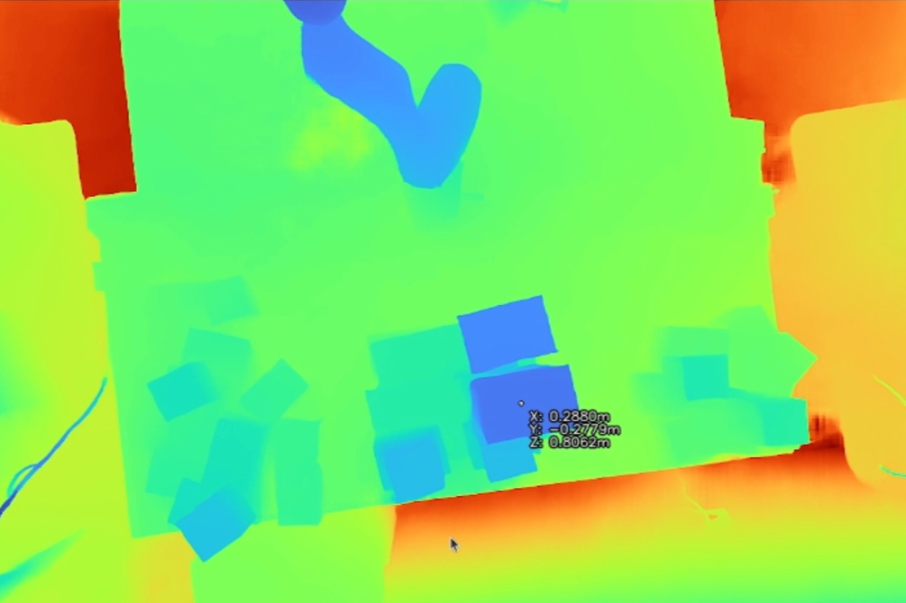

# Spatials Estimator

*System Requirements :* CUDA 11.8, cudnn 8.7, Ubuntu >= 20.04, Python 3.10
*Sensor Requirements :* OAK-D-Pro Wide or OAK-D-Pro

To download segment-anything models [click here](https://github.com/facebookresearch/segment-anything?tab=readme-ov-file#model-checkpoints) (download vit_h: ViT-H SAM model) and place it in the following location

`segment-anything\segment_anything\models`

To install dependencies : `pip install -r requirements.txt`

To execute the code : `python3 run_spatials_estimator.py`

Please ensure the model paths of CREStereo and Segment-Anything are correct in "run_spatials_estimator.py" file before executing.

## Demo

[📹 Watch Full Demo Video (43MB)](spatials_estimator_demo.mp4)

## Gallery

### Process Flow

### Input Images

  
  

  

### Segmentation Results

  
  

### ROI Detection

  
  

### Depth Estimation

  
  

### Spatial Estimation Results

  

  
  

  

### System Overview

